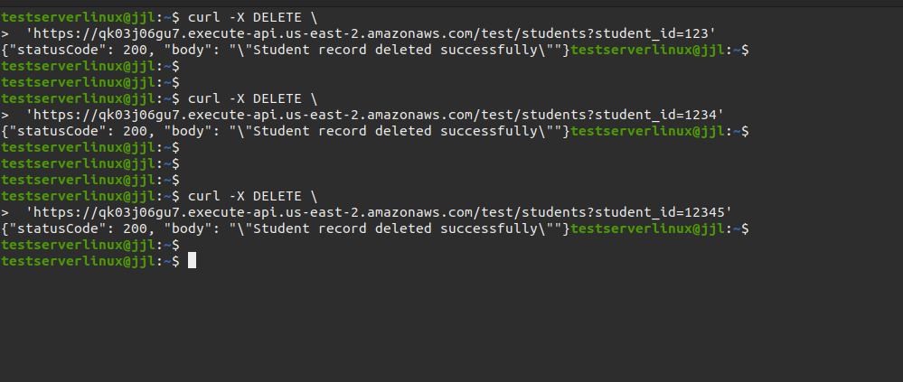

# Building-Serverless-Application

## Table of Contents

- [Introduction](#introduction)
- [Execution Screenshots](#execution-screenshots)
- [Reflection](#Reflection)
- [License](#license)

### Introduction

This project demonstrates a simple Serverless Application using AWS DynamoDB and AWS Lambda.

The lambda function codes in Python are here: [functions](functions.py).

The test API commands are here: [test.sh](test.sh).

The web application supports four API operations:

- Get /students: Retrieves student information based on a provided query string parameter student_id.
- POST /students:  Adds a student by submitting a JSON body with the primary key student_id.
- PATCH /students: Updates student information by submitting a query string parameter student_id and a JSON body.
- DELETE /students: Removes a student from the database by submitting a query string parameter student_id.

### Execution Screenshots

Initial DynamoDB table:


POST API execution:


The DynamoDB table after executing POST API:


GET API execution:


PATCH API execution:


DynamoDB table after the PATCH APIs executed:


DELETE API execution:



DynamoDB table after the DELETE APIs executed:


### Reflection

There were several challenges during the setup for this project.

1. Lambda function permissions:

    The lambda function called StudentRecoradHandler cannot retrieve or modify DynamoDB records. This was happening since StudentRecoradHandler did not have permission to modify DynamoDB. To grant permission, I navigated to IAM --> Roles --> StudentRecordHandler-role-emb0d6cf as in the image shown below:

    

    

    Then, I clicked on the "Add permissions" button and then clicked on "Create inline policy".

    I clicked on the "JSON" button, and pasted in the following JSON object I found from Google searching:

    ```json
    {
      "Version": "2012-10-17",
      "Statement": [
        {
          "Effect": "Allow",
          "Action": [
            "dynamodb:UpdateItem",
            "dynamodb:PutItem",
            "dynamodb:GetItem",
            "dynamodb:DeleteItem"
          ],
          "Resource": "arn:aws:dynamodb:us-east-2:124355661443:table/StudentRecords"
        }
      ]
    }
    ```

    

    Following this, I clicked on "Next" and fill in the policy name as "DynamoDBStudent". After creating, the permission appeared on the roles screen:

    

    Now, the StudentRecoradHandler is able to retrieve and modify DynamoDB records.

2. Mapping templates for request:

    Another challenge is, that mapping templates are needed for each method's integration request. Without mapping templates, the Resources we created under AWS API Gateway cannot map the request body and query string correctly with the lambda function we wrote. I was confused about everything that seemed fine and why the post method was not working but the get method is working. The reason was there was a defined mapping template for get API like the below image:

    ```json
    {
      "httpMethod": "$context.httpMethod",
      "queryStringParameters": {
        "student_id": "$input.params('student_id')"
      }
    }
    ```

    However, I did not do so for the post method. After I found out the root cause, I clicked on the "Edit" button on:

    

    Then, I pasted the following JSON body as:

    ```json
    {
      "httpMethod": "$context.httpMethod",
      "body": $input.json('$')
    }
    ```

    

    After that, I clicked on the "Save" button, and I deployed the API again to the same stage called "test", and the post API is now working. By troubleshooting this, I was able to get the patch and delete method working on the first attempt by adding the request mapping template.

3. Python JSON Handling:

    Since I am not familiar with Python, I was trying to use json.loads() directly on the dict() object while json.loads() only accpet str() object. It took me some hours to realize this by checking the logs carefully under CloudWatch, and I found the answer on https://stackoverflow.com/questions/42354001/json-object-must-be-str-bytes-or-bytearray-not-dict. The correct way is to do json.dumps() on the dict() object and then do json.loads() on the generated str() object. Like the below code does:

    ```python
    body = json.loads(json.dumps(event['body']))
    ```

4. Handling reserved keywords in DynamoDB

    Since I am new to DynamoDB, I did not realize that DynamoDB will block updating records when the record has some reserved keywords. For example, "name" is a reserved keyword, and the patch body will have "name" as an attribute. Therefore, DynamoDB was blocking the patch method due to the "name". After some Google search, I found https://stackoverflow.com/questions/74920856/invalid-updateexpression-attribute-name-is-a-reserved-keyword-reserved-keyword. I followed this and have the following code inside the patch method:

    ```python
    body = json.loads(json.dumps(event['body']))
    update_expression = "SET"
    expression_attribute_names = {}
    expression_attribute_values = {}
    logger.info(f"body.items: {body.items()}")

            for key, value in body.items():
                if key in ['name']:
    expression_attribute_names[f'#{key}'] = key
    update_expression += f" #{key} = :{key},"
    expression_attribute_values[f":{key}"] = value

                else:
    update_expression += f" {key} = :{key},"
    expression_attribute_values[f":{key}"] = value

    update_expression = update_expression.rstrip(',')

            try:
    table.update_item(
                    Key={'student_id': student_id},
                    UpdateExpression=update_expression,
                    ExpressionAttributeNames=expression_attribute_names,
                    ExpressionAttributeValues=expression_attribute_values
    )
    logger.info("Student record updated successfully")
                return {
                    'statusCode': 200,
                    'body': json.dumps('Student record updated successfully')
    }
            except Exception as e:
    logger.error(
                    f"Error updating student record: {str(e)}", exc_info=True)
                return {
                    'statusCode': 500,
                    'body': json.dumps(f'Error updating student record: {str(e)}')
    }

    ```

    These codes will handle the reserved word "name" as a DB query with "#name", and it will update the DB with the query.

#### Conclusion

Walking through these challenges, I gained a deeper understanding of AWS services, including IAM roles and permissions, API Gateway configurations, and how to manage DynamoDB with reserved keywords. I also improved my Python skills, learning to carefully manage JSON data structures and how to troubleshoot Lambda functions through AWS CloudWatch. These experiences have not only enhanced my technical knowledge but also honed my problem-solving abilities when working with serverless architectures.

### License

This project is licensed under the GNU General Public [LICENSE](LICENSE)
v3.0. See the LICENSE file for details.
