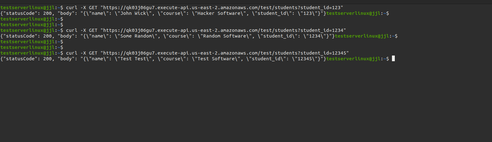
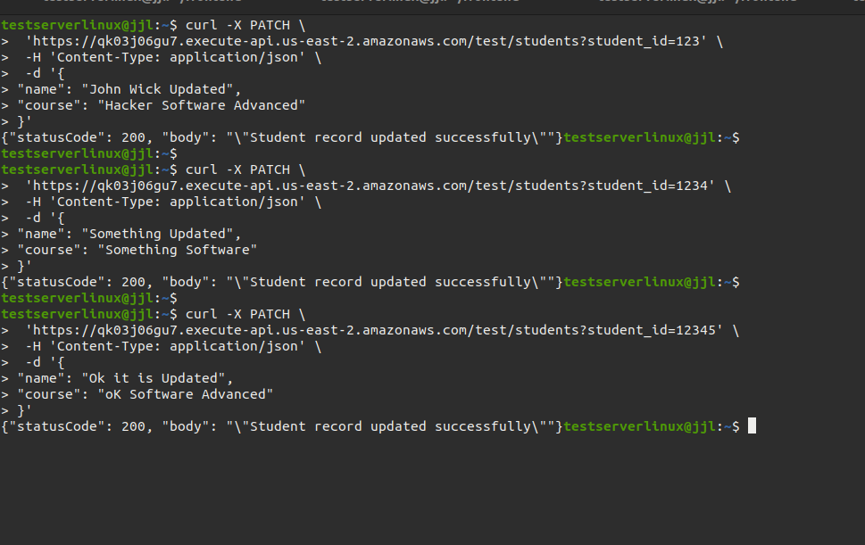

# Building-Serverless-Application

## Table of Contents

- [Introduction](#introduction)
- [Execution Screenshots](#execution-screenshots)
- [Reflection](#Reflection)
- [License](#license)

### Introduction

This project is a simple Serverless Application operated by AWS DynamoDB and AWS Lambda.

This web application supports 4 api, and they are:

- Get /students get student info with providing query string student_id
- POST /students add student with providing a json body with primary key student_id
- PATCH /students update student info with providing query string student_id and json body
- DELETE /students remove student from the database with with providing query string student_id

### Execution Screenshots

The table at the beginning:


Post Cmd screenshots:


The table after executed post cmd:


Get cmd screenshots:



Patch Cmd Screenshots:



Table after the patch cmds executed:


Delete Cmd Screenshots:


Table after the delete cmds executed:


### Reflection

There was serveral challenges during the setup for this project.

1. The lambda function called StudentRecoradHandler was not able to retrieve or modify DynamoDB records. The was happening due to StudentRecoradHandler did not have the permission for modifying DynamoDB. In order to grant permission, I navigated to IAM --> Roles --> StudentRecordHandler-role-emb0d6cf like the image shows below:


Then, I clicked on "Add permissions" button and then clicked on "Create inline policy".

I clicked on "JSON" button, and pasted in the following json object I found from google searching:

```json
{
  "Version": "2012-10-17",
  "Statement": [
    {
      "Effect": "Allow",
      "Action": [
        "dynamodb:UpdateItem",
        "dynamodb:PutItem",
        "dynamodb:GetItem",
        "dynamodb:DeleteItem"
      ],
      "Resource": "arn:aws:dynamodb:us-east-2:124355661443:table/StudentRecords"
    }
  ]
}
```


Following this, I clicked on "Next" and filled in the policy name as "DynamoDBStudent". After creating, the permission appeared on the roles screen:


Now, the StudentRecoradHandler was able to retrieve and modify DynamoDB records.

2. Another challenge is, mapping templates is need for each method's integration request. Without mapping templates, the Resources we created under AWS API Gateway cannot map the request body and query string correctly with the lambda function we wrote. I was confused about everything seems fine and why post method is not working but get method is working. The reason was I define the mapping template for the get method at the beginning.

{
"httpMethod": "$context.httpMethod",
  "queryStringParameters": {
    "student_id": "$input.params('student_id')"
}
}

3. Since I am not too familar with python, I was trying to use json.loads() directly on the dict() object while json.loads() only accpet str() object. It took me some hours to realize this by checking the logs carefully under CloudWatch, and I found the answer on https://stackoverflow.com/questions/42354001/json-object-must-be-str-bytes-or-bytearray-not-dict. The correct way is do json.dumps on the dict() object and then do json.loads() on the generated str() object. Like the below code does:

```python
    body = json.loads(json.dumps(event['body']))
```

4. Since i am new with DynamoDB, I did not realized that DynamoDB will block updating records when the record have some reserved keywords. For example, "name" is a reserved keyword, and the patch body will have "name" as an attribute. Thereforce, DynamoDB was blocking the patch method due to the "name". After some google search, I found https://stackoverflow.com/questions/74920856/invalid-updateexpression-attribute-name-is-a-reserved-keyword-reserved-keyword . I followed this and have the following code inside the patch method:

```python
        body = json.loads(json.dumps(event['body']))
        update_expression = "SET"
        expression_attribute_names = {}
        expression_attribute_values = {}
        logger.info(f"body.items: {body.items()}")

        for key, value in body.items():
            if key in ['name']:
                expression_attribute_names[f'#{key}'] = key
                update_expression += f" #{key} = :{key},"
                expression_attribute_values[f":{key}"] = value

            else:
                update_expression += f" {key} = :{key},"
                expression_attribute_values[f":{key}"] = value

        update_expression = update_expression.rstrip(',')

        try:
            table.update_item(
                Key={'student_id': student_id},
                UpdateExpression=update_expression,
                ExpressionAttributeNames=expression_attribute_names,
                ExpressionAttributeValues=expression_attribute_values
            )
            logger.info("Student record updated successfully")
            return {
                'statusCode': 200,
                'body': json.dumps('Student record updated successfully')
            }
        except Exception as e:
            logger.error(
                f"Error updating student record: {str(e)}", exc_info=True)
            return {
                'statusCode': 500,
                'body': json.dumps(f'Error updating student record: {str(e)}')
            }

```

These codes will handle the reserved word "name" as an real db query with "#name", and it will update the db with the query.

### License

This project is licensed under the GNU General Public [LICENSE](LICENSE)
v3.0. See the LICENSE file for details.
